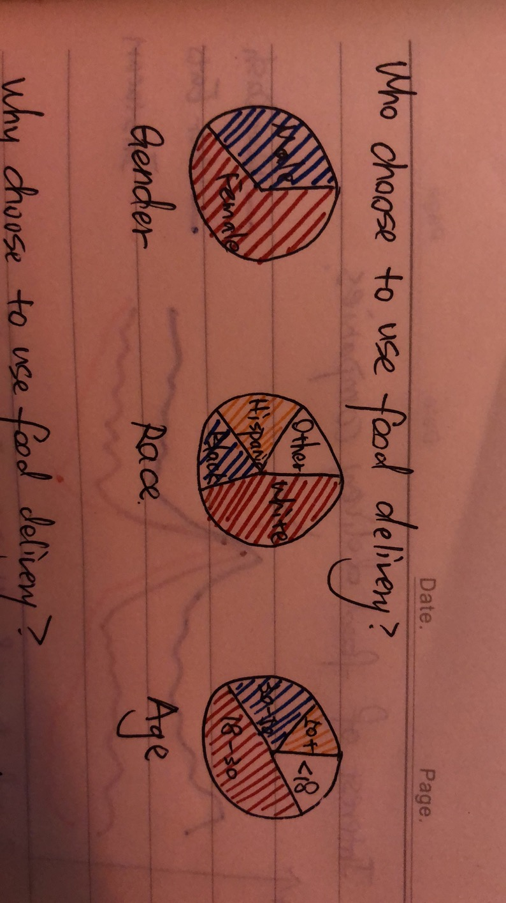
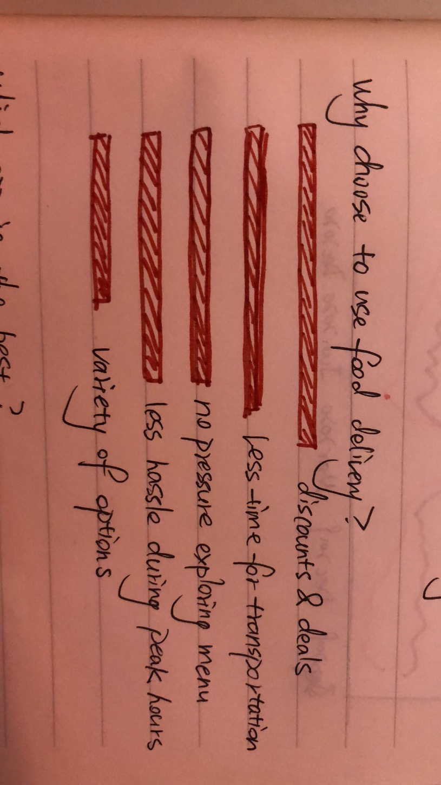
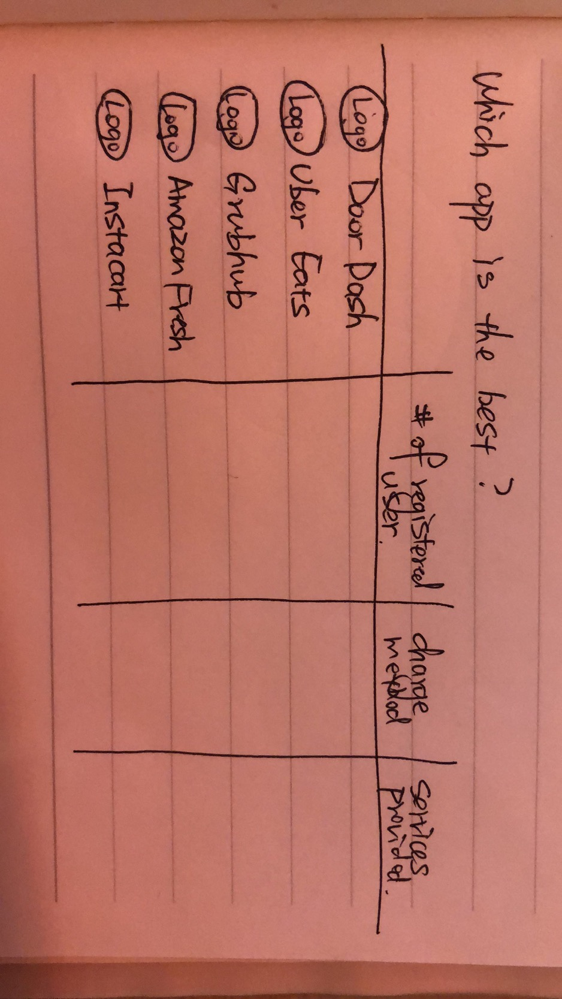
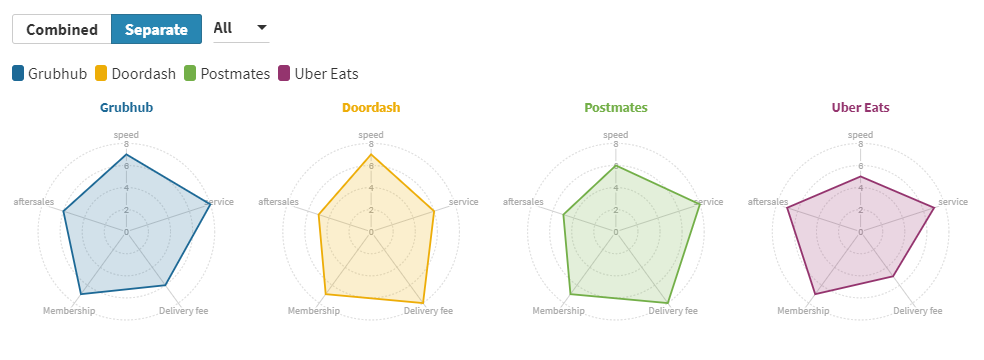
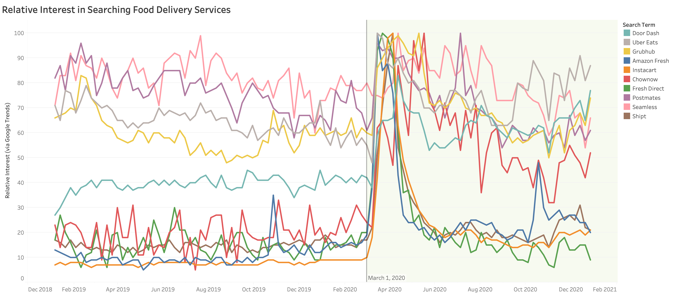

# Food Delivery Service
For many industries, the impact of COVID has largely changed their operating models and the needs of their target consumers. As a student living in Allegheny County, Pittsburgh during the pandemic, my demand for food delivery has changed most obviously and my friends also responded to the same needs. The objective of this project is to introduce food delivery service to audience, why people choose it and help audience to choose the most suitable app or website. I also plan to analysis the COVID impact on people’s need for food delivery, which works as an evidence to emphasis the popularity and advantage of this service during this special period.

# Storyline from audience perspective
1. Who choose to use food delivery? Am I in a similar demographic? 
2. Why should I start or continue to use this service? Does it truely helpful?
3. Which website should I choose to spend my money on? I need to find the best suitable one.
4. Whether this market was largely affected by COVID? How does it affect my decision?

# Data
1. Google trend
2. Google’s Community Mobility Reports 
3. Statista

# The demographic of food delivery customer

# The reason why people choose it

# Comparision of different food delivery platform

# COVID impact

# Interview
Questions Script: 
1. Have you used or currently use any food delivery platform?
2. Do you think this service is commonly used by people around you? Do you care if you are the only one use it in similar age or other demographic group?
3. Why you choose to use it at the first place and why you choose to continue use it?
4. Which platform you use the most and like the best? Why?
5. Do you think this industry is affected by COVID? How?
6. Is there any other information you want to know which is not mentioned here?

Feedback1: 
1. Yes, I'm still using it now.
2. Yes, all of my friends and family members are using it frequently, about twice a week? I don't care if I'm the only one use it at all.
3. I was attracted by the coupon of a platform and started to use it and i continue to use because it helps me to save my time on grocery.
4. I use Uber Eats the most, because I always use this one and get familiar with the functions.
5. Yes, definitely. People's demand on food delivery must increase a lot.
6. I want to see how large the increase is for poeple's demand under pandemic.

Feedback2:
1. Yes, I used it for a while but now I don't.
2. Yes, almost all of people around me have at lease use it once. If all of my friends don't use it, maybe I will choose to go grocery with them together instead of choosing food delivery.
3. I just wanna try this service and I chose to give up since i have to pay the delivery and service fee. I can save this money if i do shopping by myself.
4. I used DoorDash before, don't know whether it's the best since i don't have comparision.
5. Yes. Maybe more driver will do delivery job? if they got unemployed i guess.
6. I want to know more details about the discount policy or activity each platform have, maybe this can incentive me to use the service.

Feedback3:
1. Yes, I'm a huge fan of food delivery especially after the outbread of COVID.
2. I don't really know whether my friends use it, but my family are all huge fan of it, we like to try different restaurants and stores.
3. I just download DoorDash following its advertisement and tried it out. It helps me to save time for pick up or walking in the store to find what i want.
4. DoorDash, its speed is fast and the delivery fee is acceptable.
5. Yes. I think people have limited access of transportation, especially for those don't have their own car. So more people will tend to utilize this service.
6. I wanna know whether the quality of food delivery service will be continuing affected in the future, since COVID may not recoverred in a short term.

# Revisions I plan to do for next week
1. Add a graph of people's changing demand for food delivery services. I found the dataset from Google mobility report, but i still need to decide the scope of data. Whether it's more helpful to concentrate on Allegeny county or PA or the whole US? I plan to create this graph as a line chart, which can display the trend of demand changing.
2. Enrich the platforms comparision section. I will pick at least five measurable aspect to rate the platform and finalized the current radar chart. Also, to better explain the aspects such as membership benefits, I will add these columns into the comparision table and highlight all numbers. 
3. Create all graphs using flourish and generate the final report using canva. 
