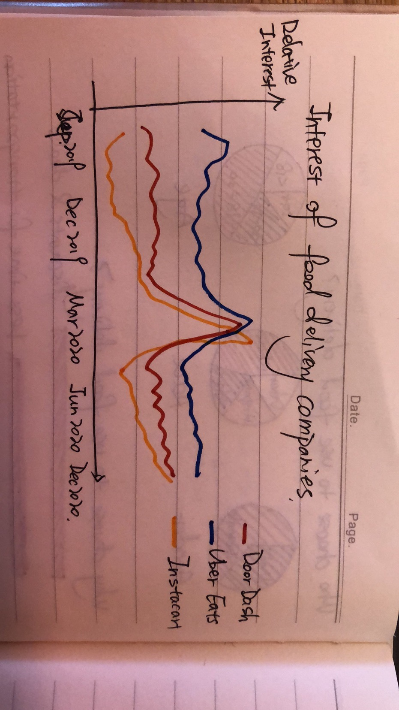
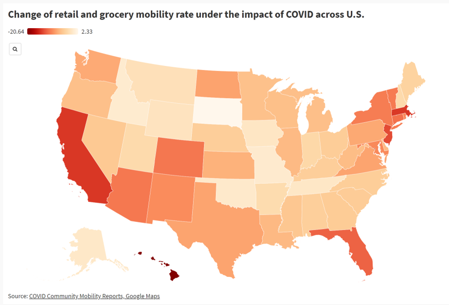
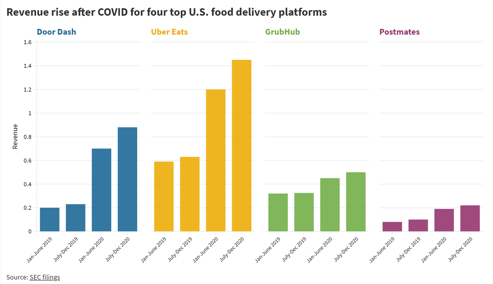
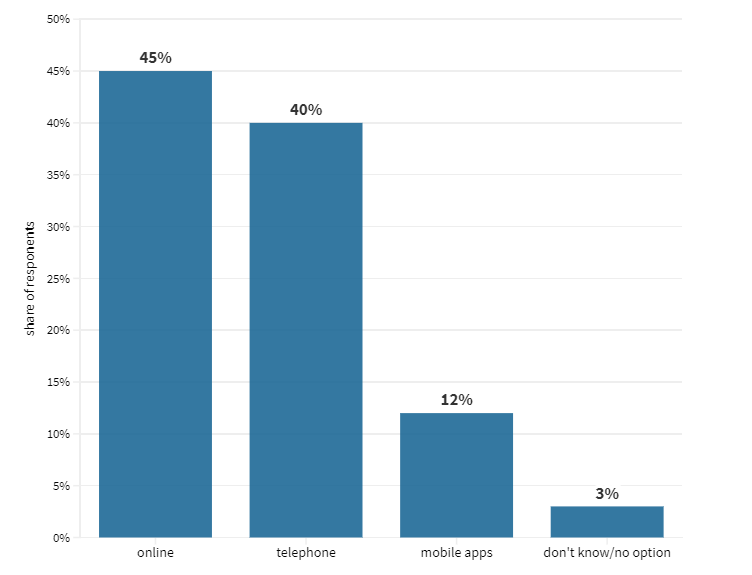
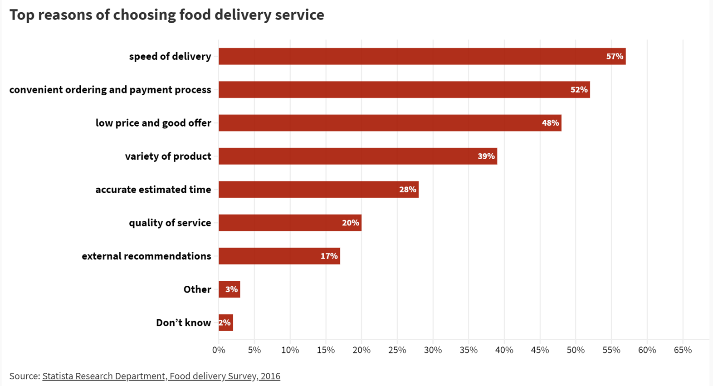
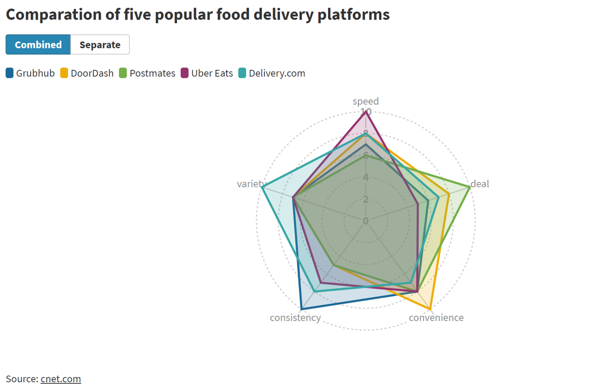
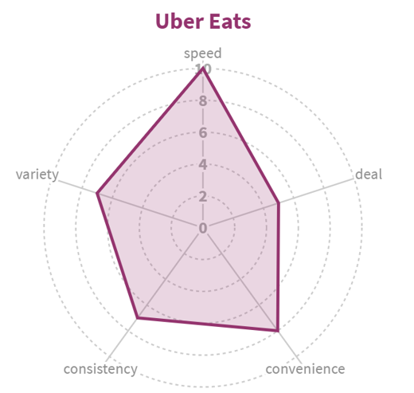
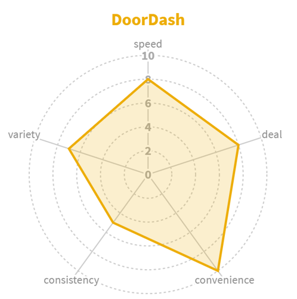
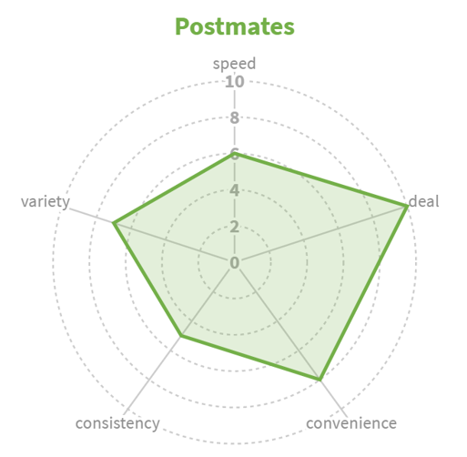
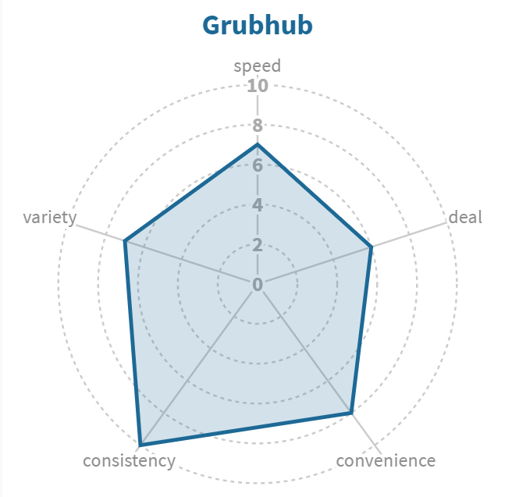

# Background and storyline
For many industries, the impact of COVID has largely changed their operating models and the needs of their target consumers. As a student living in Pittsburgh during the pandemic, I started to use this service and I believe people's demand for food delivery has increased obviously, because my friends and classmates also responded to the same needs. 
The objective of this project is to introduce food delivery service to audience, how current consumer utilize it and top reasons of why people choose it. I also designed several radar charts to help audience to choose the most suitable app or website based on the traits they valued. I introduce the increasing demand on food delivery under the impact of COVID, which works as an evidence to emphasis the popularity and advantage of this service during this special period.

# Changes
After analysising the feedbacks I got during the class and through the interviews, my project changed from the draft in Part1 to the final version in shorthand.

Part1:
1. Who choose to use food delivery? Content includes: how many people choose to use food delivery, analyzing based on different demographic groups. 
2. Why choose to use food delivery? Content includes: Ranking of the main reasons to choose this service.
3. Which apps is the best? Content includes: Comparison for different apps usually used in Allegheny county. I plan to compare the number of registered user, charge method, provided services.
4. pre and post COVID, any change?
   1) the interest changes of each food delivery company 
   2) people’s changing demand for physical grocery and eating in restaurants

Part3:
1. The increasing demand on food delivery service during COVID
I use this part as a hook for the project and presentation to tell my audience why we should care this service. I changed the sequence of it from the last to the very beginning.
Two evidences are used in this section to better explain the concept. First one is the decreasing retail and grocery mobility rate under COVID in each states. The other is the inreasng revenue of several popular food delivery platforms.

Starting from the second quarter of 2020, the impact of COVID on the United States has begun to cause changes in consumer behavior, including a significant increase in demand for food delivery services.
According to the data from Google Maps, people's mobility were limited, especially when it comes to retail and grocery. The difference of this effect is mesured at the state level and as shown in the graph, almost all of the states experienced a decreased retail and grocery mobility rate.

On the other side, an increasing on revenue for the selected four top U.S. food delivery platforms: Door Dash, Uber Eats, Grubhub, Postmates shows a clear trend. Poeple are more likely to utilize this service after COVID and this phenomenon can remain at this high livel or even keep increasing in 2021.

2. The methods chose by current users 
I didn't include this part in part 1 but I found it useful to show since I planned to guide my audience how to choose the best paltforms who provide online or mobile apps access.
This graph helps me to observe the percentage of people who choose these two methods is high enough, which make the following researches more meaningful.

This bar chart is generated based on an online survey did by S, Lock on Statista in 2018. The scope covered all states in U.S. and summaried almost 2000 responses. Respondents can only choose one option, so the sum of displayed shares is equal to 100%.
40% of the respondents showed preference on 'telephone' is because they are more familiar with this traditional method. However, the limitations of telephone order are obvious. As showed here, a total of 57% of the consumers choose to use online website or mobile apps for food delivery. Although telephone is also a major method they would like to use, many experts believe the share of respondents of online and mobile apps will increase in the future.

3. The traits most valued by users
This can be the most important graph in my project, since I chose the platforms for recommendation based on these reasons. I decided to use bright red color to better emphasis.

4. Comparation of the five selected platforms
I used the results from an experiment as my reference to create the combined and seperate radar charts. Each of the platform showed special advantage on different aspects.

1[4](final_Delivery.com.png)

5. Call to action
1) Give it a try to use food delivery if you didn't use it before. It can be a powerful service on the aspect of time saving and limited travel ability
2) Think about whether the one you select is the most suitable for you. There are lots of amazing platforms may be valuable for you to find.

# References
Pelt,Kate Van. 'Food Delivery Comparison: Grubhub Vs. Doordash Vs. Postmates Vs. Uber Eats Vs. Delivery.com', Dec 30th, 2020. https://www.moneyunder30.com/food-delivery-comparison
Rayome, Alison DeNisco. 'Best food delivery service: DoorDash, Grubhub, Uber Eats and more compared', May 13th, 2020. https://www.cnet.com/news/best-food-delivery-service-doordash-grubhub-uber-eats-and-more-compared/
Sumagaysay, Levi. 'The pandemic has more than doubled food-delivery apps’ business. Now what?', Nov 25th, 2020. https://www.marketwatch.com/story/the-pandemic-has-more-than-doubled-americans-use-of-food-delivery-apps-but-that-doesnt-mean-the-companies-are-making-money-11606340169

# Final outcome
https://carnegiemellon.shorthandstories.com/food-delivery/index.html

